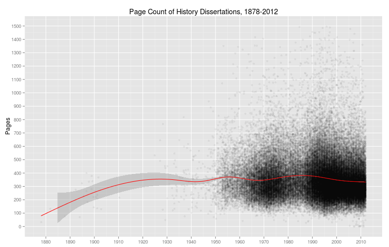
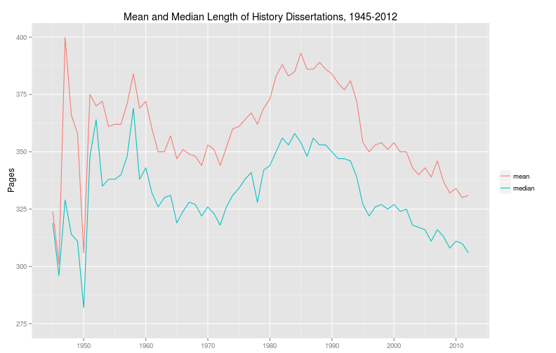
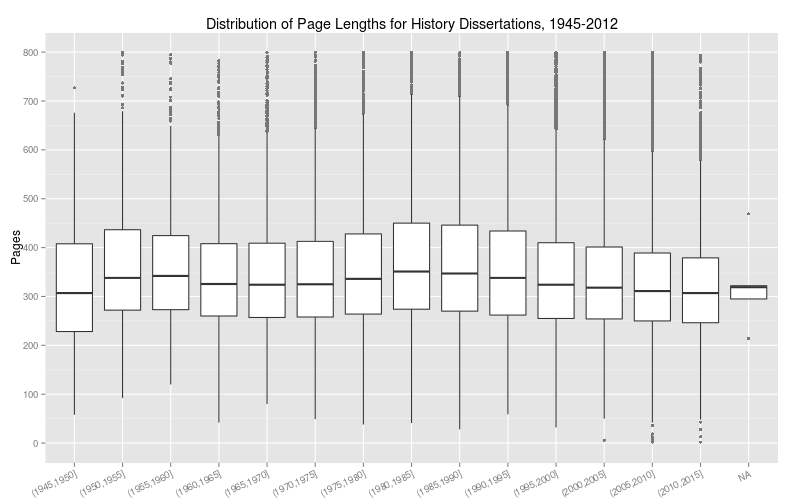

The first question anyone writing a dissertation probably asks is, How long should this thing be? When Michael Beck looked at data from the University of Minnesota, he found that [history dissertations were the longest](http://beckmw.wordpress.com/2013/04/15/how-long-is-the-average-dissertation/). Ben Schmidt found that the average length of history dissertations at Princeton [varied quite a bit](http://rpubs.com/benmschmidt/princetonhistorydiss), from a peak of about 425 pages on average around 1995 to a low of slightly more than 250 pages on average around 2006 or 2007. Ben also concluded that "300 pages is the normal length."

Using the ProQuest data, we can see how history dissertations varied in length over time.

<!--more-->

The more useful view is to look at just dissertations since 1945:

We can make a few observations. First, the average length of dissertations is remarkably stable. From 1880 to 1930, history dissertations get quite a bit longer. But since from the 1950s to the present, the average length of dissertations has fluctuated within a relatively narrow band. That band is relatively narrow, that is, in relation to the huge overall variation in the length of history dissertations, which have a normal range between 150 and 600 pages. The acceptable range can even go a little lower than 150 pages, and it can go much, much higher than 600 pages.

We can be more precise about typical length of a history dissertation by plotting the mean and median. (If you prefer, you can see that data in tabular form at the end of the post.)

The mean length is longer by 27 pages on average than the median length, as you would expect since the permissible maximum length for a dissertation is much more flexible than the permissible minimum length. But the two measures fluctuate more or less in tandem. From a peak in 1958 to a trough in 1972, dissertations got shorter by about 45 pages. Then from 1972 dissertations gradually got longer till they reached a peak in 1988 about 55 pages longer. Since 1988 dissertations are getting shorter, with 2012 being a low with a mean of 331 and a median of 306.

I don't have a good explanation for these fluctuations. Could dissertations have gotten shorter from 1958 to 1972 because of a shift from narrative or political history to social history? Then could they have gotten longer from 1972 to 1988 because of the rise of cultural history? I suppose, though the dates feel vaguely off. What explains why dissertations got shorter through the 1990s and 2000s? I think matching this data up to time-to-degree data and job market data might prove fruitful.

It's not enough to look at the mean or median dissertation length, given that there is such an enormous variation in the permissible length of dissertations. Another helpful way to look at the data is to see the distribution of the quartiles. (This chart cuts off many outliers above 800 pages long.)

The boxes in this chart show the middle 50 percent of dissertations for each half decade. We might interpret this as the typical range for most dissertations. Even typical dissertations fluctuate in length, so that the low end of typical can be 70 pages shorter than median, and the high end of typical can be 50 or 60 pages more than median. But many dissertations come in shorter, and there is a very high upper bound to the maximum length of dissertations.

Next up, I'll compare the typical length of dissertations for the academy as a whole to the length of dissertations at specific universities.

In summary, what does this data about page lengths say about history dissertations? It says that your adviser was right when she said that the dissertation will be done when you've written what you need to write.

---

Some caveats: There are definitely errors in the data, for example, a six page dissertation from Princeton advised by Robert Darnton. (Sweet deal, if you can get it.) But there are only 215 dissertations with fewer than 100 pages, and only 53 dissertations with more than 1500 pages, so I don't think these errors skew the data that much. Though it is scarcely believable, the dissertations above 1500 are probably not all errors, either. Another problem is that we're dealing with number of pages rather than word counts, and the number of words per page presumably changes with different writing technologies. (The definition of a word, on the other hand, is stable and timeless, even eternal.) Fortunately the timebound and hideous formatting requirements that universitites impose on dissertations probably keep this variation in check.

**Mean and Median Length of History Dissertations, 1945--2012**

| year | mean | median |
|-----:|-----:|-------:|
| 1945 | 324 | 319 |
| 1946 | 301 | 296 |
| 1947 | 400 | 329 |
| 1948 | 366 | 314 |
| 1949 | 358 | 311 |
| 1950 | 306 | 282 |
| 1951 | 375 | 348 |
| 1952 | 370 | 364 |
| 1953 | 372 | 335 |
| 1954 | 361 | 338 |
| 1955 | 362 | 338 |
| 1956 | 362 | 340 |
| 1957 | 371 | 348 |
| 1958 | 384 | 369 |
| 1959 | 369 | 338 |
| 1960 | 372 | 343 |
| 1961 | 360 | 332 |
| 1962 | 350 | 326 |
| 1963 | 350 | 330 |
| 1964 | 357 | 331 |
| 1965 | 347 | 319 |
| 1966 | 351 | 324 |
| 1967 | 349 | 328 |
| 1968 | 348 | 327 |
| 1969 | 344 | 322 |
| 1970 | 353 | 326 |
| 1971 | 351 | 323 |
| 1972 | 344 | 318 |
| 1973 | 352 | 326 |
| 1974 | 360 | 331 |
| 1975 | 361 | 334 |
| 1976 | 364 | 338 |
| 1977 | 367 | 341 |
| 1978 | 362 | 328 |
| 1979 | 369 | 342 |
| 1980 | 373 | 344 |
| 1981 | 383 | 350 |
| 1982 | 388 | 356 |
| 1983 | 383 | 353 |
| 1984 | 385 | 358 |
| 1985 | 393 | 354 |
| 1986 | 386 | 348 |
| 1987 | 386 | 356 |
| 1988 | 389 | 353 |
| 1989 | 386 | 353 |
| 1990 | 384 | 350 |
| 1991 | 380 | 347 |
| 1992 | 377 | 347 |
| 1993 | 381 | 346 |
| 1994 | 372 | 339 |
| 1995 | 354 | 327 |
| 1996 | 350 | 322 |
| 1997 | 353 | 326 |
| 1998 | 354 | 327 |
| 1999 | 351 | 325 |
| 2000 | 354 | 327 |
| 2001 | 350 | 324 |
| 2002 | 350 | 325 |
| 2003 | 343 | 318 |
| 2004 | 340 | 317 |
| 2005 | 343 | 316 |
| 2006 | 339 | 311 |
| 2007 | 346 | 316 |
| 2008 | 337 | 313 |
| 2009 | 332 | 308 |
| 2010 | 334 | 311 |
| 2011 | 330 | 310 |
| 2012 | 331 | 306 |
| 2013 | 333 | 311 |
