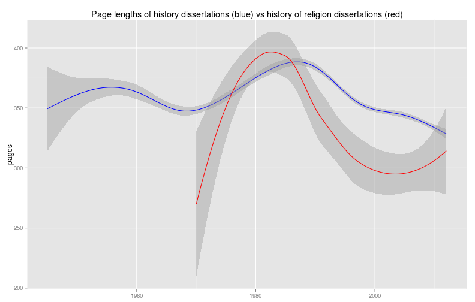
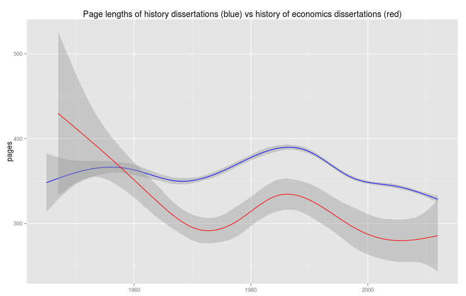
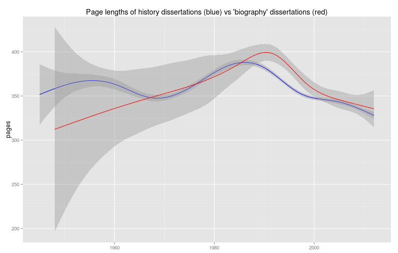
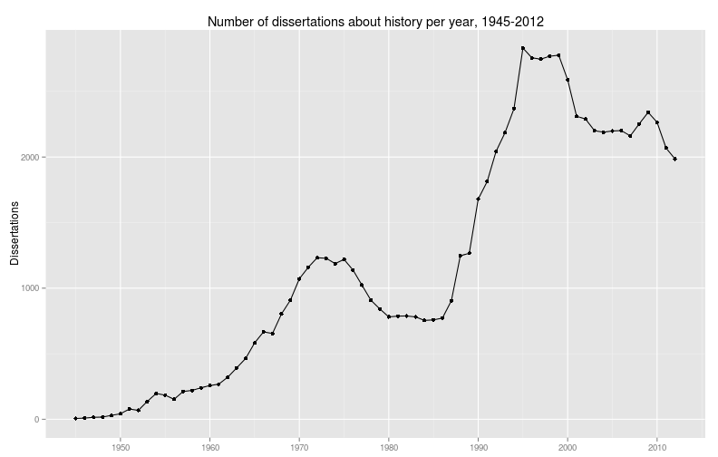

After posts about the length of dissertations about history university by university and for the American academy as a whole, along with a map of where history dissertations have been written, this post will be much less interesting. In this post I want to write about some decisions that I've made to further clean and tidy the data, and the consequent revisions to earlier visualizations. I'm writing about this process because I have conceived of this series of posts as being not just a presentation of my findings about history dissertations, but a set of reflections on the process of data analysis as performed by a historian. I hope this series will be pedagogically useful. Certainly no one ever taught me how to do this kind of data analysis in a history department, and it's not that hard to find scientists complaining that no one ever taught them how to do this kind of work. So I hope this series of posts and the [accompanying code](https://github.com/lmullen/dissertations-data) is one [resource](http://programminghistorian.org/) [among](http://geospatialhistorian.wordpress.com/) [many](http://software-carpentry.org/), and in particular that it will be useful as a guide to the many steps in digging through a mid- to large-sized data set.

First, what do I mean by cleaning and tidying data? By cleaning data I mean standardizing the values of the data to make them more useful. For example, I have filtered out at least twenty thousand irrelevant dissertations from the data set. Cleaning might also mean performing an operation like standardizing the name of a university, or joining all the fields that hold paragraphs for an abstract into one field. By tidying data I mean what [Hadley Wickham](http://had.co.nz/) means in this fantastic [journal article](http://vita.had.co.nz/papers/tidy-data.pdf) and [talk](http://vimeo.com/33727555), namely, changing the structure of data so that "each variable is a column, each observation is a row, and each type of observational unit is a table." To put it a different way, tidying data is [normalizing the data](http://en.wikipedia.org/wiki/Database_normalization); cleaning the data is akin to proofreading the data.

So why do I need to clean and tidy the data after five posts? One possible model of how data analysis should proceed is that you first clean the data, then analyze. Another possible model is that you first set up the basic structure of the analysis, then clean the data to get the results that you want. In practice, learning from data is a process that iterates between analysis and cleaning. The process is iterative because you have to analyze the data before you know how the data must be cleaned and tidied, and you have to clean and tidy the data to make certain kinds of analysis available.

These are the kinds of tidying and cleaning that can happen at this stage.

First, [mapping the dissertations](http://lincolnmullen.com/blog/analyzing-historical-history-dissertations-location/) made it obvious that the ProQuest data set contains very incomplete information for dissertations written outside North America. We may as well throw away those observations, since they are too incomplete to tell us anything useful. The data set also contains 4,608 dissertations from Canada. Looking at the quality of the data recorded for those Canadian dissertations, it seems that they are worth keeping. The deciding point for me is that the [AHA Directory of History Dissertations](https://secure.historians.org/pubs/dissertations/index.cfm) also includes Canadian dissertations.

Second, looking closely at the list of universities shows that there are some, such as the "Yale University, School of Forestry and Environmental Studies" which represent the occasional dissertation that might be about history, but is probably so far afield from the norm of a dissertation in history department that these may as well be excluded. Most of these will be dropped anyway when we filter the dissertations by subject.

Now we have a more difficult decision to make, since we have to decide what counts as a dissertation in history. There is a strong argument to be made that the best definition is a dissertation written in a history department. Unfortunately, since only 7.64 percent of the dissertations in this data set identify their department, it is impossible to use that definition. But there are intellectual justifications for a more capacious definition. Certainly in my own field of American religious history, many if not most of the dissertations are written by people in religious studies departments, divinity schools, Judaic Studies departments, and the like. Economic history, particularly of a quantitative bent, has mostly moved to economics departments (though history of capitalism is making a roaring comeback in history departments). So I have no problem with using the ProQuest subject headings to study a broader definition of what a history dissertation is.

The sticking point for me is whether to include dissertations with the subject "Education, History of" as dissertations in history.

<!--more-->

The argument that such dissertations are usually written in schools of education rather than colleges of arts and sciences, are therefore held to different norms and so should be excluded from this study is persuasive to me. But we can also test the hypothesis that they are held to different norms.

Here is a chart of the page lengths of history of education dissertations vs all other kinds of history dissertations.

There is a very wide divergence between the history of education and the other history dissertations, so I've decided to reverse my earlier decision and exclude them from the data set.

There is no such divergence for history of religion dissertations, so they can stay.

History of science has a bizarre trajectory compared to every other kind of history. (Historians of science, any ideas what is going on here?) But even though historians of science are often in different departments, they can stay in the data set.

History of economics diverges from general history (though not as sharply as history of education). I'm betting that's because such dissertations are more likely to use quantitative methods, so they can stay.

Biography also seems close to the profession in general.

As a last step, I'm dropping all universities with fewer than five dissertations that meet all these criteria. Looking through these universities, many of their dissertations seem like false positives, so this cut-off should clean up problems in the long tail.

Making these changes to the data set gives us fewer dissertations: 84428 dissertations before, 80575 after cleaning, which is 3853 fewer dissertations. It's a messy process, but then the data is messy. Keep that in mind the next time you're impressed by a slick visualization.

---

Now that the data is more thoroughly cleaned, I have redone some of the more significant visualizations from the earlier posts.

First, the number of dissertations per year.

Second, the mean and median page counts of history dissertations. These are slightly higher after cleaning the data more thoroughly.

Finally, a redo of all the page counts by university. (Because nothing makes a post popular like giving every historian in North America a little blue dot of their own to look for.)

---


























































































































































































































































































































































































